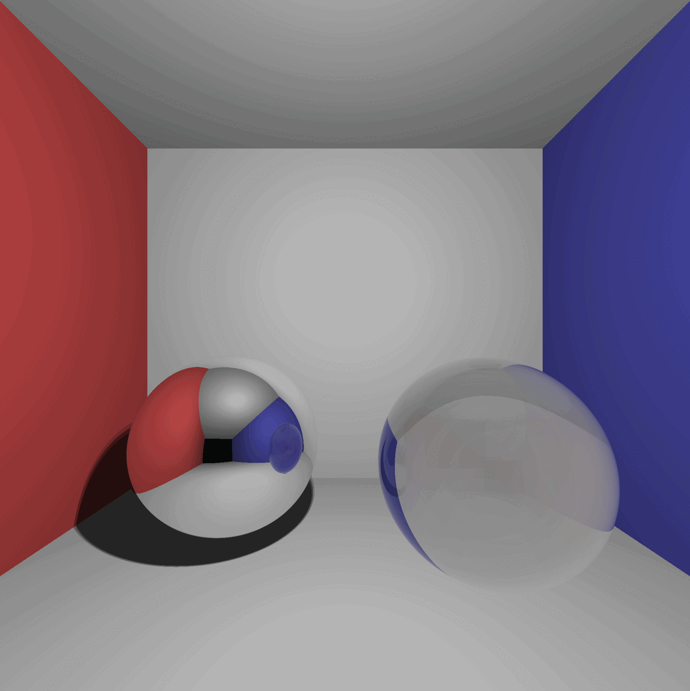
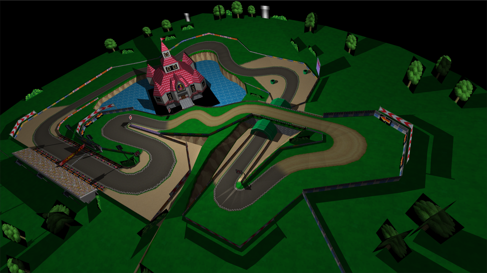

## MiniRT

**miniRT** offers an exploration of ray tracing.

This method excels at creating visually stunning images by simulating how light rays travel, 
interact, and reflect off various surfaces and materials.
The interdisciplinary nature of ray tracing, combining elements of physics, mathematics, and computer graphics, 
is one of the reasons rendering is such a fascinating and challenging field of study.

## Table of Contents

- [Render](#render)
- [Usage](#usage)
- [Controls](#controls)
- [Features](#features)
- [Supported File Formats](#supported-file-formats)
- [Credits](#credits)
- 
-
-
-
-
-
-
-
-

## Render

<!-- Table one -->
<table style="width:100%; border-collapse:collapse;">	
  <tr>
    <!-- Title -->
			<th colspan=2>Table 1</th>
	</tr>
  <tr>
    <td style="width:50%; padding:5px; text-align:center;">
      
screen 1

      
    </td>
    <td style="width:50%; padding:5px; text-align:center;">
      
screen 2

      
    </td>
  </tr>
	</tr>
    <td style="width:50%; padding:5px; text-align:center;">
      
screen 3

      
    </td>
    <td style="width:50%; padding:5px; text-align:center;">
      
screen 4

      
    </td>
  </tr>
</table>
<!-- Table Two -->
<table style="width:100%; border-collapse:collapse;">	
  <tr>
    <!-- Title -->
			<th colspan=2>Table 2</th>
	</tr>
  <tr>
    <td style="width:50%; padding:5px; text-align:center;">
      
screen 1

      
    </td>
    <td style="width:50%; padding:5px; text-align:center;">
      
screen 2

      
    </td>
  </tr>
</table>

## Controls

| **Key**                  | **Function**                              |
|--------------------------|-------------------------------------------|
| **Enter**                | Start rendering                           |
| **M**                    | Change render mode (boxes/normal/uv)      |
| **W**, **A**, **S**, **D** |Camera forward (W), left (A), backward (S), right (D)
| **Space**                | Camera up                                 |
| **Ctrl**                 | Camera down                               |
| **Q**, **E**             | Camera roll left (Q),  roll right(E)      |
| **R**                    | Reset roll angle                          |
| **Wheel Up**             | Increase camera speed                     |
| **Wheel Down**           | Reduce camera speed                       |
| **B**                    | BVH visualization on/off                  |
| **Left arrow**, **Right arrow** | Decrease/increase BVH multi layer depth |
| **Down arrow**, **Up arrow** | Decrease/increase BVH single layer depth  |
| **Esc**                  | Exit the program                          |

## Usage
## Features
## Supported File Formats
## Credits

- [Charlie Couble](https://github.com/c-couble)
- [Léo Espenel](https://github.com/lespenel)
