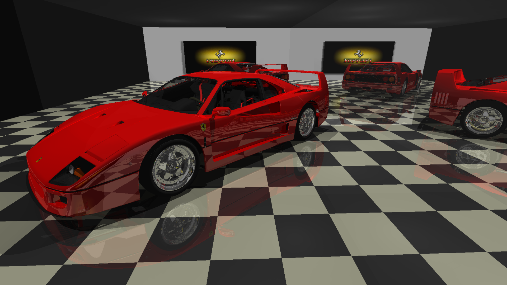
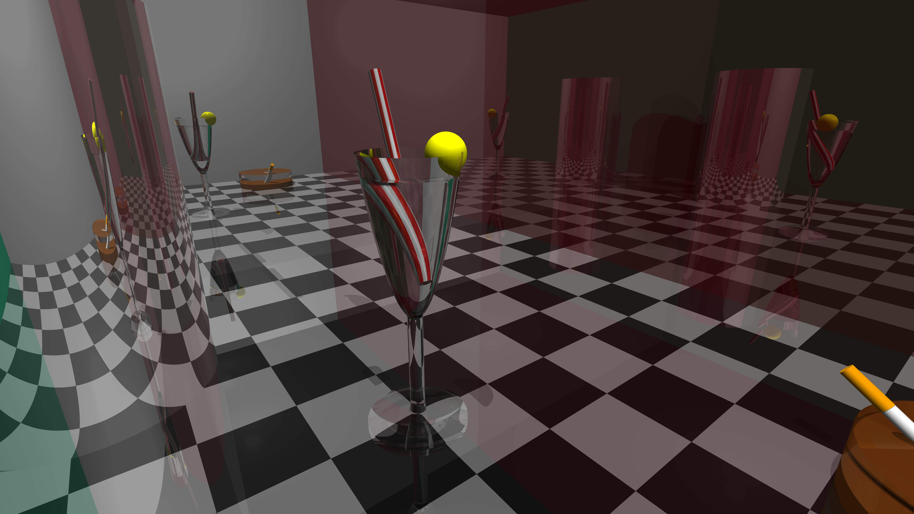
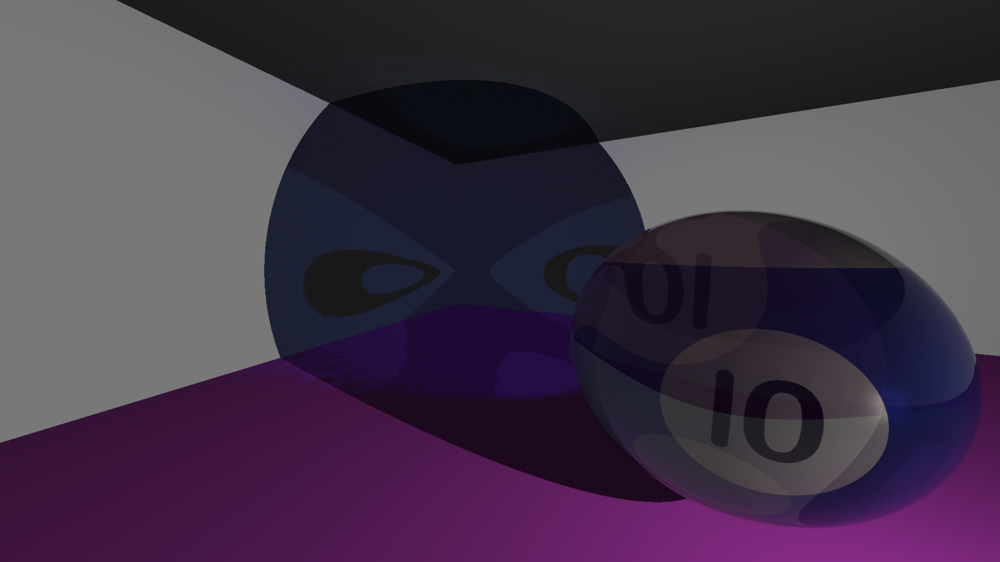
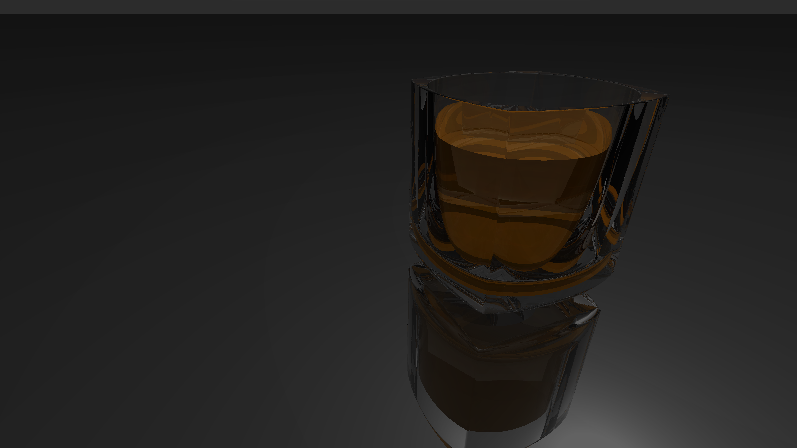
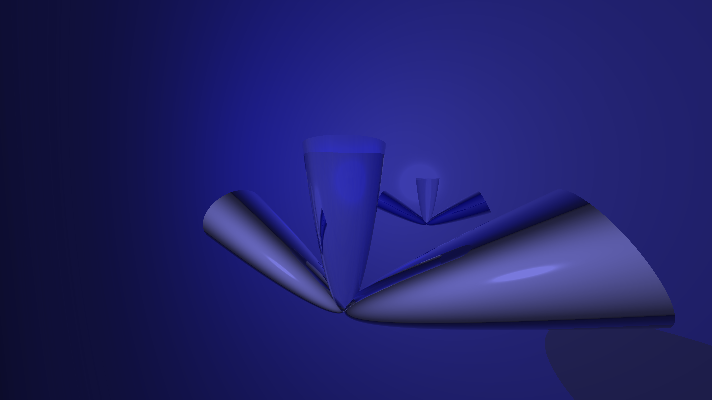
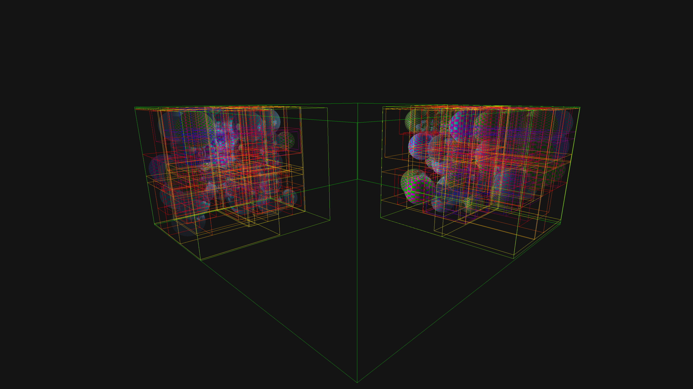
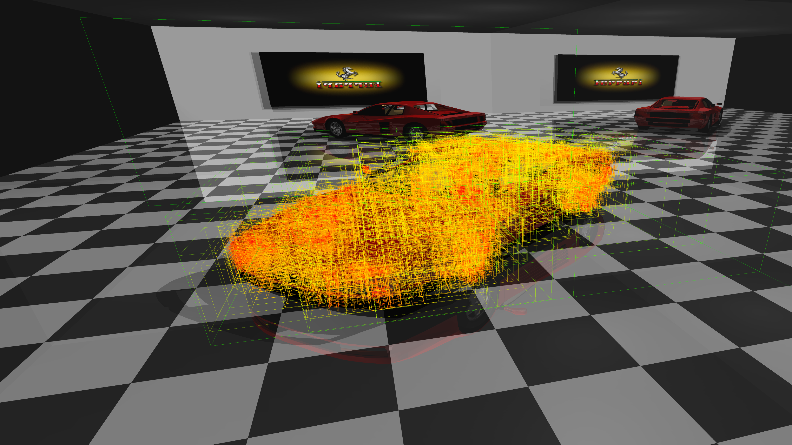

## MiniRT

**miniRT** offers an exploration of ray tracing.

This method excels at creating visually stunning images by simulating how light rays travel, 
interact, and reflect off various surfaces and materials.
The interdisciplinary nature of ray tracing, combining elements of physics, mathematics, and computer graphics, 
is one of the reasons rendering is such a fascinating and challenging field of study.

## Table of Contents


- [Gallery](#gallery)
- [Usage](#usage)
- [Controls](#controls)
- [Supported File Formats](#supported-file-formats)
- [Features](#features)
- [Credits](#credits)
- 
- 
- 
-
-
-

## Gallery




<!-- Table one -->
<table style="width:100%; border-collapse:collapse;">	
  <tr>
    <!-- Title -->
			<th colspan=2>Table 1</th>
	</tr>
  <tr>
    <td style="width:50%; padding:5px; text-align:center;">
      <div style="font-weight:bold; margin-bottom:5px;"></div>
      
    </td>
    <td style="width:50%; padding:5px; text-align:center;">
      <div style="font-weight:bold; margin-bottom:5px;"></div>
      
    </td>
  </tr>
	</tr>
    <td style="width:50%; padding:5px; text-align:center;">
      <div style="font-weight:bold; margin-bottom:5px;"></div>
      
    </td>
    <td style="width:50%; padding:5px; text-align:center;">
      <div style="font-weight:bold; margin-bottom:5px;"></div>
      
    </td>
  </tr>
</table>
<!-- Table Two -->
<table style="width:100%; border-collapse:collapse;">	
  <tr>
    <!-- Title -->
			<th colspan=2>BVH</th>
	</tr>
  <tr>
    <td style="width:50%; padding:5px; text-align:center;">
      <div style="font-weight:bold; margin-bottom:5px;">Two groups of sphere</div>
      
    </td>
    <td style="width:50%; padding:5px; text-align:center;">
      <div style="font-weight:bold; margin-bottom:5px;">polygon mesh</div>
      
    </td>
  </tr>
</table>


## Usage

To view the detailed information on how to create a .rt please check out the [detailed .rt section](#section-rt) below.

## Controls

| **Key**                  | **Function**                              |
|--------------------------|-------------------------------------------|
| **Enter**                | Start rendering                           |
| **M**                    | Change render mode (boxes/normal/uv)      |
| **W**, **A**, **S**, **D** |Camera forward (W), left (A), backward (S), right (D)
| **Space**                | Camera up                                 |
| **Ctrl**                 | Camera down                               |
| **Q**, **E**             | Camera roll left (Q),  roll right(E)      |
| **R**                    | Reset roll angle                          |
| **Wheel Up**             | Increase camera speed                     |
| **Wheel Down**           | Reduce camera speed                       |
| **B**                    | BVH visualization on/off                  |
| **Left arrow**, **Right arrow** | Decrease/increase BVH multi layer depth |
| **Down arrow**, **Up arrow** | Decrease/increase BVH single layer depth  |
| **Num 7**, **Num 9** | Decrease/increase Caustic bandwidth  |
| **Num 4**, **Num 6** | Decrease/increase Caustic nearest neighbour number  |
| **Num 1**, **Num 3** | Decrease/increase Caustic brightness scalar  |
| **P** | Save high quality screenshot in ppm format |
| **Esc**                  | Exit the program                          |

## Supported File Formats

The `.rt` file is used to define a 3D scene for rendering. It includes descriptions of ambient lighting, cameras, lights, and various geometrical shapes. Each section of the file can include additional details such as material properties, checkerboard patterns, and textures.

<details id="section-rt">
 <summary><strong><mark>Click to see the detailed .rt section</mark></strong></summary>

### General Rules
- Each element type starts with a unique identifier.
- The following elements can only be declared once in the scene:
  - **Ambient lighting (`A`)**
  - **Camera (`C`)**
- You can add multiple instances of other elements, such as lights (`L`), spheres (`sp`), planes (`pl`), cylinders (`cy`), and paraboloids (`pa`).
- Element-specific information must follow in a strict order based on the defined format.
- Elements can be separated by one or more line breaks, and information within an element can be separated by one or more spaces.
- The order of element declarations within the file is flexible; you may place them in any sequence.
- Ensure that all coordinates are in 3D space, and colors are represented in standard RGB format.
- For geometrical shapes, an optional material section can be added after the object definition to specify properties like diffuse and specular ratios.
- Checkerboard patterns can be optionally applied to geometrical shapes.
- Textures can also be specified for shapes, allowing for image-based appearances.

### Object Summary Table

| **Identifier** | **Description**  | **Format**                                                                                             |
|----------------|------------------|--------------------------------------------------------------------------------------------------------|
| `A`            | Ambient Lighting  | `A <ambient_lighting_ratio> <R,G,B>`                                                                  |
| `C`            | Camera            | `C <view_point_x,y,z> <orientation_x,y,z> <FOV>`                                                      |
| `L`            | Light             | `L <position_x,y,z> <brightness_ratio> <R,G,B>`                                                       |
| `sp`           | Sphere            | `sp <center_x,y,z> <diameter> <R,G,B>`                    				             |
| `pl`           | Plane             | `pl <point_x,y,z> <normal_x,y,z> <R,G,B>`                                                             |
| `cy`           | Cylinder          | `cy <center_x,y,z> <axis_vector_x,y,z> <diameter> <height> <R,G,B>`			             |
| `pa`           | Paraboloid        | `pa <center_x,y,z> <axis_vector_x,y,z> <radius> <height> <disk> <R,G,B>`|
| `mesh`           | Mesh        | `mesh <object_path.obj> <center_x,y,z> <axis_vector_front_x,y,z> <axis_vector_up_x,y,z> <scale>`|

### Optional specification can be added at the end of any geometry:

### Material (`ma`)

`ma:<kd>,<ks>,<ss>,<reflection>,<refraction>,<refraction_blend>`

| **Property**     | **Description**                                          | **Range**                          |
|------------------|----------------------------------------------------------|------------------------------------|
| `kd`             | Diffuse ratio (float `0.0` to `1.0`)                    | `0.0` to `1.0`                     |
| `ks`             | Specular ratio (float `0.0` to `1.0`)                   | `0.0` to `1.0`                     |
| `ss`             | Specular shine (float `0` to `DBLMAX`)                  | `0` to `DBLMAX`                    |
| `reflection`     | Reflection ratio (float `0.0` to `1.0`)                 | `0.0` (no reflection) to `1.0` (full reflection) |
| `refraction`     | Refraction index (integer `1` to `5` or `0`)            | `0` (none), `1` to `5.0`           |
| `refraction_blend`     | Refraction blend (float `0.0` to `1.0`)           	     | `0.0` (no refraction) to `1.0` (full refraction) |

### Checkerboard (`ch`)
`ch:<x_size>,<y_size> <R,G,B> <R,G,B>`

| **Property**   | **Description**                                                            | **Range**                         |
|----------------|----------------------------------------------------------------------------|-----------------------------------|
| `x_size`       | Number of tiles along the X-axis                                           | `0` to `INT_MAX/2` (integer)      |
| `y_size`       | Number of tiles along the Y-axis                                           | `0` to `INT_MAX/2` (integer)      |
| `x_color`      | Color for the tiles in the X direction                                     | `R,G,B` values `[0-255]`          |
| `y_color`      | Color for the tiles in the Y direction                                     | `R,G,B` values `[0-255]`          |

### Texture (`tx`)
`tx:<path_to_texture1>,<path_to_texture2(optional)>,<path_to_texture3(optional)>`

| **Property**      | **Description**                                                   | **Details**                                   |
|-------------------|-------------------------------------------------------------------|-----------------------------------------------|
| `texture1.ppm`    | Texture for the main shape                                        | Applicable to all shapes                      |
| `texture2.ppm`    | (Optional) Top texture					        | Only for shapes like cylinders and paraboloids|
| `texture3.ppm`    | (Optional) Bottom texture					        | Only for cylinders                            |

### Normal Map (`nm`)
`nm:<path_to_normal_map>,<path_to_normal_map2(optional)>,<path_to_normal_map3(optional)>`

| **Property**      | **Description**                                                   | **Details**                                   |
|-------------------|-------------------------------------------------------------------|-----------------------------------------------|
| `normal_map1.ppm` | Normal Map for the main shape                                     | Applicable to all shapes                      |
| `normal_map2.ppm` | (Optional) Top Normal Map				        	| Only for shapes like cylinders and paraboloids|
| `normal_map3.ppm` | (Optional) Bottom Normal Map			        	| Only for cylinders                            |

### Background Color (`bkg`)
`bkg:<R,G,B>`

### Caustic (`ca`)
`ca:<photon_nb>`

### Save render (`sr`)
`sr:<width>,<height>`

### Sample .rt File

```plaintext
C 0,-25,60 0,1,0 90

A 0.2 255,255,255

L 0,30,99 1 255,255,255

pl 0,0,0 0,0,-1 180,180,180 ma:0.85,1.0,64,0.4,0 ch:1,1 40,40,40 210,210,200

cy 50,50,50 0.5,0,1 20 50 208,210,215

sp 0,50.6,50 20 255,0,0 ma:0.79,1,1024,0.08,0 tx:textures/pool_14.ppm

pa -50,50,25 0,0,1 20 50 0 220,220,190 ch:10,10 120,20,220 220,50,120
```
</details>

## Features

### Lighting and Shading Models:
- **Phong Illumination Model**: Full support for Phong shading with diffuse, specular, and ambient components.
- **Reflection**: Accurate reflections based on material properties, allowing for reflective surfaces.
- **Refraction**: Simulation of light refraction through transparent materials such as glass or water.
- **Fresnel Effect**: Simulates how the reflectivity of a surface changes based on the viewing angle, adding realism to materials like glass, water, and metals.
- **Caustics**: Precise rendering of light concentration effects caused by reflection and refraction (e.g., light patterns under water).

### Textures and Materials:
- **Normal Mapping**: Adds fine surface detail with normal maps without increasing the geometric complexity.
- **Textures**: Apply textures to customize the appearance of surfaces.
- **Checkerboard Pattern**: Configurable checkerboard pattern for planar surfaces.

### Geometries Supported:
- **Sphere, Cylinder, Paraboloid, Plane**: Basic geometric primitives with precise intersection handling.
- **Triangle Meshes**: Support for complex objects represented by triangle meshes.
- **Bounding Volume Hierarchy (BVH)**: An acceleration structure to improve the performance of intersection testing in complex scenes.

### Camera and Rendering:
- **Camera Movement**: Free camera movement through the scene, allowing dynamic exploration from different angles.
- **Adaptive Resolution**: Automatically adjusts the resolution in real-time to maintain smooth framerate during free camera movement.
- **High-Quality Rendering**: Supports rendering in high-quality **PPM (Portable Pixmap)** format for detailed outputs.

### Performance and Optimization:
- **Multithreading**: Fully utilizes multicore processors to perform ray tracing calculations in parallel, significantly improving rendering performance.
- **BVH (Bounding Volume Hierarchy)**: Efficient ray-object intersection calculations using a hierarchical structure, improving rendering performance for large and complex scenes.
- **Adaptive Resolution**: Dynamically reduces resolution to maintain a smooth framerate in free camera mode, while providing full resolution when needed.

### Visualization and Customization:
- **BVH Visualization**: Visualize the **BVH** structure layer by layer, enabling better understanding and debugging of the acceleration structure.
- **Background Color Change**: Customize the background color of the scene to fit different rendering needs or artistic styles.
- **Debug Mode**: Switch between different debug views:
  - **Normal Mode**: Visualize surface normals.
  - **UV Mode**: Display UV coordinates for texturing and debugging.
  - **Bounding Box Mode**: Show bounding boxes for objects to visualize the BVH hierarchy and object culling.

## Credits

- [Charlie Couble](https://github.com/c-couble)
- [Léo Espenel](https://github.com/lespenel)
